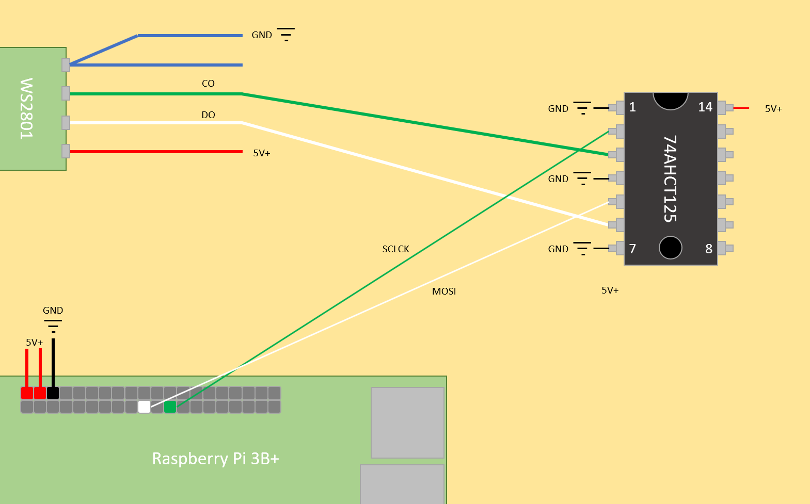

# wallpretty
WS2801 project, creating a mountable, interactive, LED... thinger

## Background
There are plenty of ways to build something like this.  I used a RaspberryPi 3B+ on Raspbian Buster.  Python 3.7+ is a requirement because of the `quart` import.  Other webservers will work fine, but I chose quart because of how simply it allows websockets.  There are no .js includes on the HTML side, so that piece of the communications is easy to parse by a human.  Learning more about websockets was a side goal for this project.

## Important Files
- test.py: Runs WS2801 grid demo
- websocket-quart.py: HTTP-based control for grid
- templates/index.html: Base HTML doc for quart to render and send to client browsers
- ws2801_funcs.py: Carries some of the WS2801 functions
- Dockerfile: Attempt to make this Docker-able.  WIP.  GPIO is hard.  (-:

## Parts List
- [RaspberryPi with breadboard, power supply, MicroSD card, etc](https://smile.amazon.com/gp/product/B07BC567TW); demo build is a 3B+
- [WS2801 LED strings](https://smile.amazon.com/gp/product/B0192VUDNG); demo build has 4 strings, 200 lights total
- [3 to 5V logic stepper](https://smile.amazon.com/gp/product/B00XW2L39K); strictly speaking, this isn't required, but you may less flicker with this included
- [Wires that plug into breadboards easily](https://smile.amazon.com/gp/product/B01EV70C78)
- [T-connectors](https://smile.amazon.com/gp/product/B07114RK67); they make powering the strings in parallel much easier
- Lexan or Plexi or cardboard or whatever you'd like to mount on!

## Wiring

There are wiring coloring assumptions that may not hold true!  Please check specs of your materials before going ahead.  
Central to all of this are 5V+ and GND, of course.  With a breadboard adapter connecting the Pi, I used the 5V+/- rails on the edge for all power and ground.  I tried adding an external 5V power source to these rails and removed the MicroUSB power, but the Pi wouldn't power up consistently.  NB: while power can be transmitted all the way down the chain, there will be noticeable dimming.  The T-connectors make parallel power pretty easy.  
For signal, the WS2801 string needs CO connected to SCLCK on the Pi, and DO connected to MOSI.  They can be connected directly with some success, but the stepper has improved results for me.

## Tools List
- Multimeter to check connections and voltage
- [Knife for cutting Lexan/Plexi/etc](https://smile.amazon.com/gp/product/B000C027ZE)

